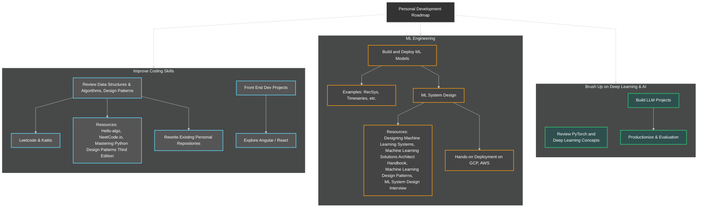

# Personal Development Roadmap
This repository contains a Mermaid-based diagram visualizing a personal development roadmap. The roadmap is designed to help track progress in acquiring new skills and achieving professional objectives.

